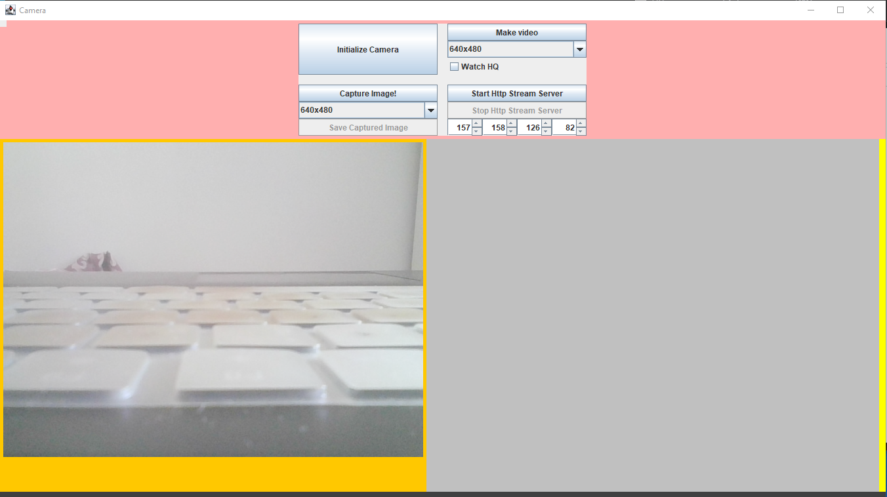
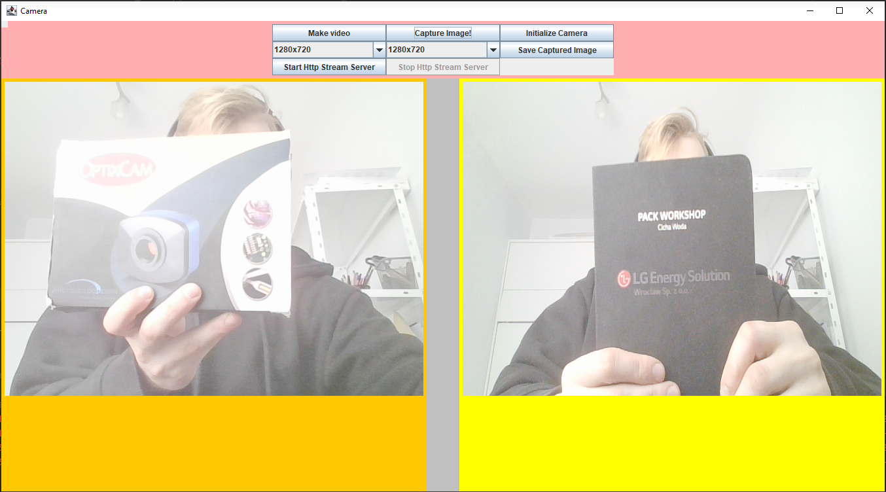
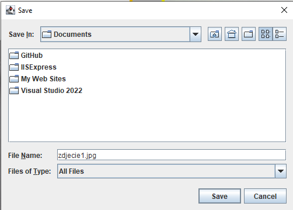
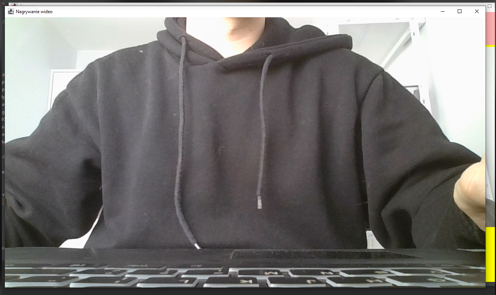
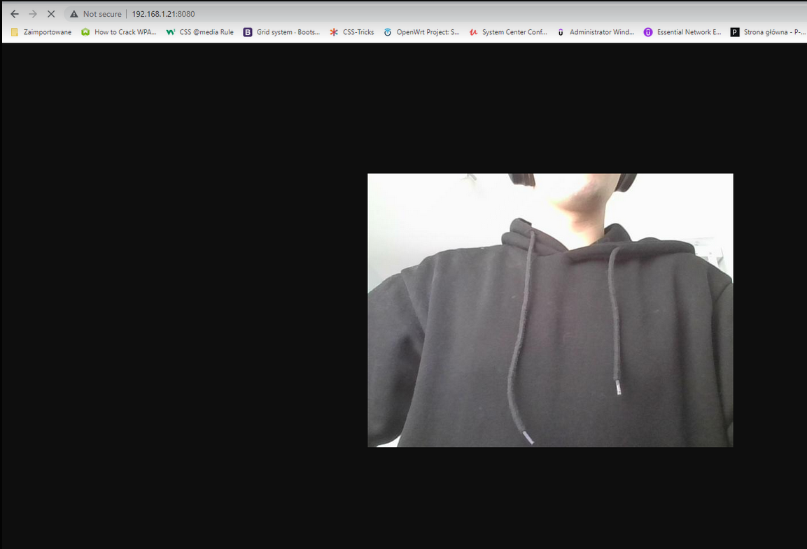

<!-- \begin{vfill}
	\begin{raggedleft}
	IPpp sem. 6 \\*
	sekcja 4 \\*
	Andrzej Zagórski \\*
	Michał Lubczyński \\*
	Artur Kuś \\*
	\end{raggedleft}
\end{vfill} -->

\newpage

# 1. Wstęp

## 1.1. Założenia ogólne
CameraRaspberry to aplikacja desktopowa oparta o okienka, która umożliwia obsługę prototypowej kamery mikroskopowej na
plarformie RasbperryPi.

Funkcjonalność aplikacji jest następująca:

- przechwyt serii klatek z sensora graficznego kamery oraz wyświetlanie ich w postaci filmu na ekranie,
- możliwość zapisu przechwyconej klatki w jednych z dostępnych rozdzielczości sensora,
- nagrywanie filmu na dysk jednej z dostępnych rozdzielczości sensora,
- udostępnianie serii klatek z kamerki w czasie rzeczywistym na webserwerze w sieci lokalnej.

## 1.2 Podział obowiązków
Podział obowiązków w projekcie był następujący:

- Michał Lubczyński: implementacja w języku Java, diagramy
- Andrzej Zagórski: implementacja w języku Java, zagadnienia związane z kompatybilnością
- Artur Kuś: dokumentacja kodu, refaktoryzacja

# 2. Obsługa aplikacji

Opis przycisków:

Initialize Camera - pozwala na zainicjalizowanie działania sensora. Po naciśnięciu tego przyciisku w głównej części
okna powinien pojawić się rzeczywisty obraz z kamery na pomarańczowym tle. Powinny również zostać odblokowane
przyciski do przechwytu obrazu oraz przyciski do obsługi serwera http.


\newpage

Capture image - pozwala na zatrzymanie klatki w danym momencie. Lista pod przyciskiem pozwala wybrać rozdzielczość
przechwyconego obrazu. Zatrzymana klatka powinna pojawić się po prawej stronie na żółtym tle.


\newpage

Save captured image - pozwala na zapis klatki w postaci zdjęcia w wybranym przez użytkownika folderze (file dialog).


\newpage

Make video - rozpoczyna nagrywanie wideo w ustalonej przez użytkownika rozdzielczości w liście poniżej. Powinno pojawić
się nowe okno z podglądem nagrania. Wyjście z tego okna przerywa nagranie.

Whatch HQ - zaznaczenie powoduje, że oglądane wideo jest w rozdzielczości HD.


\newpage

Start http stream server - pozwana na rozpoczęcie udostępniania obrazu z kamery w sieci lokalnej.
Stop http stream server - pozwana na przerwanie udostępniania obrazu z kamery w sieci lokalnej.
Pod przyciskiem "Stop http stream server" można wybrać adres IP, na jaki zostanie udostępniony
obraz kamery.


\newpage

# 3. Rozwiązania implementacyjne CameraRaspberry

## 3.1 Technologia użyta w projekcie
Technologie zastosowane w projekcie to:

- Java oraz jej elementy biblioteki standardowej
(w sczególności te pozwalające na bezpieczne używanie wielu wątków),
- Swing,
- AWT,
- OpenCV

## 3.2 Diagram klas
Zrobić diagram klas
<!--  -->

## 3.3. Wielowątkowość
Aby program działał prawidłowo. Należało poszczególne części programu uruchamiać w osobnych
wątkach. Te części to:

- bierzące wyświetlanie aktualnego obrazu kamery na ekranie,
- zapis poszczególnych klatek,
- rejestracja wideo,
- transmisja zapisanych klatek na serwerze HTTP.

Aby program mógł działać wielowątkowo, klasa z metodą, którą chcemy uruchomić w nowym wątku musi
implementować w języku Java interfejs ```Runnable``` oraz zaimplementować metodę ```run()``` która
zostanie uruchomiona i może działać dopóki się nie skończy, lub jej nie przerwiemy wykonując na
klasie polecenie ```interrupt()```. Przykład działania w kodzie programu - transmisja obrazu na
serwer HTTP:

```java
public class HttpStreamServer implements Runnable {
	...
    //! Klatka do wyświetlenia na serwerze.
    public BufferedImage imag;

    //! Funkcja rozpoczynająca transmisję na serwer http.
    public void startStreamingServer() throws IOException {
		...
	}
    
    //! Funkcja główna wątka, która cyklicznie wysyła obraz z kamery na serwer.
    public void run() {
        try {
            ...
            startStreamingServer();
            while (true) {
                pushImage(imag);
            }
        } catch (IOException e) {
            ...
        }
    }
	...
}
```

Należało też rozwiązać problem współdzielenia pamięci przez w.w wątki, aby nie dochodziło do
odczytywania niepoprawnych danych. Do tego użyliśmy zmiennych typu ```AtomicBoolean```,
które pomagają w priorytetyzowaniu tego, który wątek powinien mieć dostęp do zasobu.
Przykład użycia w programie (przechwytywanie klatek z kamery):

```java
static void Capture(
	FrameGrabber[] cam,
	Frame[] GrabbedFrame,
	AtomicBoolean priorityQueue,
	CanvasFrame window,
	JPanel right,
	int prevWidth,
	int prevHeight, 
	int MAX_WIDTH, 
	int MAX_HEIGHT, 
	Object lock
) {
	...
	Runnable runnableCapturingImage = new Runnable() {
		@Override
		public void run() {
			...
			priorityQueue.set(true);
			synchronized (lock){
				...
				// Przechwytywanie klatki i konwertowanie do postaci
				// dającej się wyświetlać w panelu okienkowym
				...
				priorityQueue.set(false);
				lock.notifyAll();
			}
		}
	};
	try{
		new Thread(runnableCapturingImage).start();
	} catch (Exception exception) {}
}
```

# 5. Wnioski
Jeżeli chodzi o ogólne założenia, program działa prawidłowo. Obraz z kametki jest
poprawnie przetwarzany oraz przesyłany po protokole HTTP. Program spisuje się dobrze
z większością urządzeń USB dzięki użyciu biblioteki OpenCV.

Niestety nie został rozwiązany przez nas problem dotyczący uruchomienia programu na
konkretnym sprzęcie, do którego program ten był przeznaczony (kamera dołączana do
Raspberry PI marki ArduCam), która pomimo zainstalowania odpowiednich sterowników, które
są zalecane przez producenta, nie chce się uruchomić w napisanym przez nas środowisku,
ani w samym systemie Raspberry. Jest to natomiast problem natury sprzętowej, więc można
go pominąć przy analizie programu, jako że udało się przetestować go używając innego
sprzętu spełniającego wymagania.
