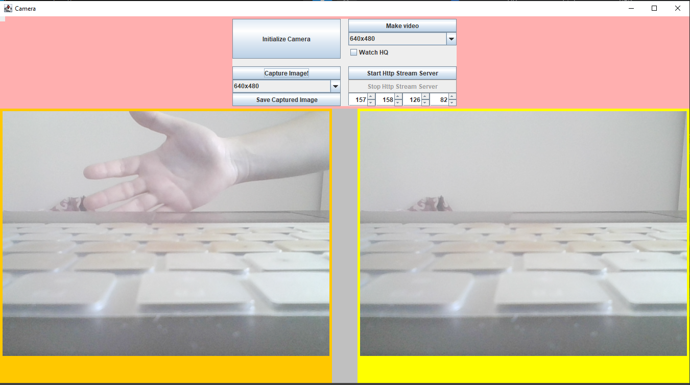
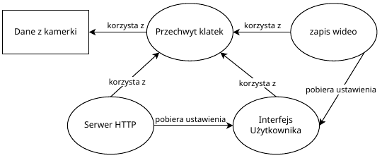

<!-- \begin{vfill}
	\begin{raggedleft}
	IPpp sem. 6 \\*
	sekcja 4 \\*
	Andrzej Zagórski \\*
	Michał Lubczyński \\*
	Artur Kuś \\*
	\end{raggedleft}
\end{vfill} -->


\newpage

# 1. Wstęp

## 1.1. Założenia ogólne
CameraRaspberry to aplikacja desktopowa oparta o okienka, która umożliwia obsługę
prototypowej kamery mikroskopowej na plarformie RasbperryPi.

Funkcjonalność aplikacji jest następująca:

- przechwyt serii klatek z sensora graficznego kamery oraz wyświetlanie ich w postaci
filmu na ekranie,
- możliwość zapisu przechwyconej klatki w jednych z dostępnych rozdzielczości sensora,
- nagrywanie filmu na dysk jednej z dostępnych rozdzielczości sensora,
- udostępnianie serii klatek z kamerki w czasie rzeczywistym na webserwerze w sieci lokalnej.

## 1.2 Podział obowiązków
Podział obowiązków w projekcie był następujący:

- Michał Lubczyński: implementacja w języku Java, diagramy
- Andrzej Zagórski: implementacja w języku Java, zagadnienia związane z kompatybilnością
- Artur Kuś: dokumentacja kodu, refaktoryzacja

# 2. Obsługa aplikacji

## 2.1 Przypadki użycia
Opis przypadków użycia dla aplikacji, która pozwala użytkownikowi na:

1. Inicjalizację kamery.
2. Zapis z kamery klatki.
3. Rejestrację wideo.
4. Uruchomienie serwera, na którym można odczytać aktualne video z kamery.

### 2.1.1 Inicjalizacja kamery
Opis: Użytkownik ma możliwość inicjalizacji kamery przed rozpoczęciem nagrywania 
lub przesyłania obrazu przez serwer.

Warunki wstępne: Aplikacja jest uruchomiona i kamera jest podłączona do komputera.

Warunki końcowe: Kamera jest gotowa do nagrywania lub przesyłania obrazu.

Scenariusz główny:

1. Użytkownik naciska przycisk "Initialize camera".
2. Aplikacja uruchamia kamerę.
4. Aktualny obraz z kamery pojawia się na ekranie.

Po naciśnięciu "Initialize camera" w głównej części okna powinien pojawić się rzeczywisty
obraz z kamery na **pomarańczowym tle**. Powinny również zostać odblokowaneprzyciski do przechwytu
obrazu oraz przyciski do obsługi serwera http.


\newpage

### 2.1.2 Zapis obrazu na dysku twardym
Opis: Użytkownik ma możliwość zapisania klatki z kamery na dysku lokalnym.

Warunki wstępne: Kamera jest zainicjalizowana i gotowa do nagrywania.

Warunki końcowe: Klatka z kamery zostaje zapisana na dysku lokalnym.

Scenariusz główny:

1. Użytkownik naciska przycisk "Capture Image".
2. Aplikacja zatrzymuje klatkę i wyświetla ją na **żółtym tle** obok rzeczywistego podglądu
obrazu kamery.
3. Użytkownik wybiera z listy rozwijanej rozdzielczość zapisu klatki.
4. Użytkownik naciska przycisk "Save image".
5. Pojawia się nowe okno z wyborem miejsca zapisu na dysku.
6. Użytkownik wybiera miejsce zapisu.
7. Aplikacja zapisuje obraz z kamerki w wybranym miejscu na dusku.





\newpage

### 2.1.3 Nagrywanie wideo
Opis: Użytkownik ma możliwość rozpoczęcia nagrywania wideo z kamery.

Warunki wstępne: Kamera jest zainicjalizowana i gotowa do nagrywania.

Warunki końcowe: Nagrywanie wideo zostaje zakończone.

Scenariusz główny:

1. Użytkownik naciska przycisk "Record video".
2. Użytkownik wybiera z listy rozwijanej inną rozdzielczość nagrywania.
3. Aplikacja otwiera nowe okno z podglądem nagrywanego wideo z kamery.
4. Użytkownik przytrzymuje klawisz __Esc__.
5. Aplikacja kończy nagrywanie wideo i zapisuje je na dysku twardym.


\newpage

### 2.1.4 Uruchomienie serwera HTTP
Opis: Użytkownik ma możliwość uruchomienia serwera, na którym będzie dostępne aktualne
video z kamery.

Warunki wstępne: Kamera jest zainicjalizowana i gotowa do nagrywania lub przesyłania obrazu,
a wcześniej zostało już zainstalowane oprogramowanie serwera.

Warunki końcowe: Serwer jest uruchomiony i wyświetla aktualne video z kamery.

Scenariusz główny:

1. Użytkownik naciska przycisk "Start http stream server".
2. Użytkownik wybiera adres IP, na jaki zostanie udostępniony obraz kamery.
3. Aplikacja uruchamia serwer.
4. Serwer wyświetla aktualne video z kamery na lokalnej stronie.
5. Inny użytkownik może przeglądać aktualne video na lokalnej stronie.


\newpage


### 2.1.5 Zatrzymanie serwera HTTP
Opis: Użytkownik ma możliwość zatrzymania serwera.

Warunki wstępne: Serwer jest uruchomiony.

Warunki końcowe: Serwer jest zatrzymany.

Scenariusz główny:

1. Użytkownik naciska przycisk "Stop http stream server".
2. Aplikacja zatrzymuje serwer.
3. Inny użytkownik przestaje widzieć aktualny obraz z kamery z sieci lokalnej.


# 3. Rozwiązania implementacyjne CameraRaspberry

## 3.1 Technologia użyta w projekcie
Technologie zastosowane w projekcie to:

Java oraz jej elementy biblioteki standardowej (w sczególności te pozwalające na bezpieczne
używanie wielu wątków):

- Runnable
- Thread
- AtomicBoolean
- Socket

Oraz dodatkowe biblioteki:

- Swing,
- AWT,
- OpenCV

## 3.2 Diagram klas

\newpage

## 3.3 Wielowątkowość

### 3.3.1 Schemat ogólny działania wielowątkowego

Aby program działał prawidłowo. Należało poszczególne części programu uruchamiać w osobnych
wątkach. Te części to:

- bierzące wyświetlanie aktualnego obrazu kamery na ekranie,
- zapis poszczególnych klatek,
- rejestracja wideo,
- transmisja zapisanych klatek na serwerze HTTP.



Legenda:

- elipsy oznaczają poszczególne wątki
- prostokąt oznacza zasób

### 3.3.2 Implementacja w języku Java

Aby program mógł działać wielowątkowo, klasa z metodą, którą chcemy uruchomić w nowym wątku musi
implementować w języku Java interfejs ```Runnable``` oraz zaimplementować metodę ```run()``` która
zostanie uruchomiona i może działać dopóki się nie skończy, lub jej nie przerwiemy wykonując na
klasie polecenie ```interrupt()```. Przykład działania w kodzie programu - transmisja obrazu na
serwer HTTP:

```java
public class HttpStreamServer implements Runnable {
	...
    //! Klatka do wyświetlenia na serwerze.
    public BufferedImage imag;

    //! Funkcja rozpoczynająca transmisję na serwer http.
    public void startStreamingServer() throws IOException {
		...
	}
    
    //! Funkcja główna wątka, która cyklicznie wysyła obraz z kamery na serwer.
    public void run() {
        try {
            ...
            startStreamingServer();
            while (true) {
                pushImage(imag);
            }
        } catch (IOException e) {
            ...
        }
    }
	...
}
```

Należało też rozwiązać problem współdzielenia pamięci przez w.w wątki, aby nie dochodziło do
odczytywania niepoprawnych danych. Do tego użyliśmy zmiennych typu ```AtomicBoolean```,
które pomagają w priorytetyzowaniu tego, który wątek powinien mieć dostęp do zasobu.
Przykład użycia w programie (przechwytywanie klatek z kamery):

```java
static void Capture(
	FrameGrabber[] cam,
	Frame[] GrabbedFrame,
	AtomicBoolean priorityQueue,
	CanvasFrame window,
	JPanel right,
	int prevWidth,
	int prevHeight, 
	int MAX_WIDTH, 
	int MAX_HEIGHT, 
	Object lock
) {
	...
	Runnable runnableCapturingImage = new Runnable() {
		@Override
		public void run() {
			...
			priorityQueue.set(true);
			synchronized (lock){
				...
				// Przechwytywanie klatki i konwertowanie do postaci
				// dającej się wyświetlać w panelu okienkowym
				...
				priorityQueue.set(false);
				lock.notifyAll();
			}
		}
	};
	try{
		new Thread(runnableCapturingImage).start();
	} catch (Exception exception) {}
}
```

Tutaj jest ustawiana kolejka na ```true``` dopóki wątek nie wykona sekcji krytycznej,
a jeżeli inny wątek chce się do niego dostać, to musi czekać:

```java
...
while(priorityQueue.get()) {
	try {
		lock.wait();
	} catch (InterruptedException e) {
		throw new RuntimeException(e);
	}
}
...
```

# 4. Wnioski
Jeżeli chodzi o ogólne założenia, program działa prawidłowo. Obraz z kametki jest
poprawnie przetwarzany oraz przesyłany po protokole HTTP. Program spisuje się dobrze
z większością urządzeń USB dzięki użyciu biblioteki OpenCV.

Niestety nie został rozwiązany przez nas problem dotyczący uruchomienia programu na
konkretnym sprzęcie, do którego program ten był przeznaczony (kamera dołączana do
Raspberry PI marki ArduCam), która pomimo zainstalowania odpowiednich sterowników, które
są zalecane przez producenta, nie chce się uruchomić w napisanym przez nas środowisku,
ani w samym systemie Raspberry. Jest to natomiast problem natury sprzętowej, więc można
go pominąć przy analizie programu, jako że udało się przetestować go używając innego
sprzętu spełniającego wymagania.
